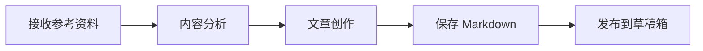

# WeChat Blog Write & Publish Skill

基于参考资料自动创作微信公众号文章，并发布到公众号草稿箱的 AI 技能。

## ✨ 特性

- 🎯 **智能创作**：基于参考资料（网页、文档、PDF）自动生成高质量文章
- 📝 **专业排版**：遵循微信公众号排版规范，美观易读
- 🚀 **一键发布**：自动发布到公众号草稿箱，无需手动操作
- 📊 **可视化图表**：支持 Mermaid 语法，自动生成流程图、架构图
- 🎨 **多主题支持**：内置 8 种主题样式，满足不同风格需求

## 📋 工作流程



### 1️⃣ 接收输入
- 支持网页链接、文档、PDF 等多种格式
- 确认文章主题、内容方向和写作风格

### 2️⃣ 内容创作
严格遵循四大标准：
- ✅ **准确性**：严格依据参考资料，信息可靠
- ✅ **专业性**：提供深度内容和实用价值
- ✅ **可读性**：通俗易懂，必要时解释专业术语
- ✅ **逻辑性**：结构清晰，层次分明

### 3️⃣ 排版设计
- 合理使用 Markdown 标题层级
- 段落分隔清晰，重点突出
- 适度使用表情符号增强可读性

### 4️⃣ 发布文章
使用 `wenyan-cli` 工具一键发布到微信公众号草稿箱

## 🛠️ 安装与配置

### 安装 wenyan-cli

```bash
npm install -g @wenyan-md/cli
```

### 配置公众号凭证

1. **获取 AppID 和 AppSecret**
   - 登录 [微信公众号后台](https://mp.weixin.qq.com)
   - 进入"设置与开发" → "开发接口管理"
   - 复制 AppID 和 AppSecret

2. **配置 IP 白名单** ⚠️
   - 在公众号后台"开发接口管理" → "基本配置" → "IP 白名单"
   - 添加本机公网 IP（访问 [ip.sb](https://ip.sb) 查看）
   - **重要**：未配置白名单会导致 `40164` 错误

3. **配置环境变量**
   ```bash
   export WECHAT_APP_ID="你的AppID"
   export WECHAT_APP_SECRET="你的AppSecret"
   ```

## 📖 使用指南

### 快速开始

```bash
# 一键发布 Markdown 文章到公众号草稿箱
wenyan publish -f article.md
```

### 内容输入方式

| 方式 | 示例 | 说明 |
|------|------|------|
| 本地路径（推荐） | `wenyan publish -f article.md` | CLI 直接读取磁盘上的文章 |
| URL | `wenyan publish -f http://test.md` | CLI 直接读取网络上的文章 |
| 参数 | `wenyan publish "# 文章"` | 适用于快速发布短内容 |
| 管道 | `cat article.md \| wenyan publish` | 适用于 CI/CD，脚本批量发布 |

### 命令概览

| 命令 | 说明 |
|------|------|
| `wenyan publish` | 发布文章 |
| `wenyan render` | 渲染 HTML |
| `wenyan theme` | 管理主题 |
| `wenyan serve` | 启动 Server |

## 📄 Front Matter 格式

每篇 Markdown 顶部需要包含 frontmatter：

```markdown
---
title: 文章标题（必填）
cover: /Users/xxx/image.jpg
author: 作者名
source_url: http://
---
```

**字段说明：**
- `title`：文章标题（必填）
- `cover`：文章封面（本地路径或网络图片，如果正文中已有图片可省略）
- `author`：文章作者
- `source_url`：原文地址

## 📷 文内图片和文章封面

文颜会按照微信要求自动处理文章内的所有图片，将其上传到公众号素材库。支持以下图片格式：

- 本地硬盘绝对路径（如：`/Users/xxx/image.jpg`）
- 网络路径（如：`https://example.com/image.jpg`）
- 当前文章的相对路径（如：`./assets/image.png`，仅当内容输入方式为"本地路径"时支持）

## 💡 使用示例

### 示例 1：基于网页链接

**输入：**
```
请根据这个链接写一篇关于 LangChain 的公众号文章：
https://python.langchain.com/docs/get_started/introduction
```

**执行流程：**
1. 抓取并分析网页内容
2. 创作文章（包含 Front Matter、Mermaid 图表、表情符号）
3. 保存为 `langchain-intro.md`
4. 执行 `wenyan publish -f langchain-intro.md` 发布

### 示例 2：基于多个参考资料

**输入：**
```
请根据以下资料写一篇 AI 产品经理的文章：
- 文档：/path/to/product-methods.pdf
- 链接：https://example.com/ai-pm-guide
```

**执行流程：**
1. 读取 PDF 文档和网页内容
2. 整合信息，创作结构化文章
3. 保存为 `ai-product-manager.md`
4. 执行 `wenyan publish -f ai-product-manager.md` 发布

## ⚠️ 常见问题

| 问题 | 解决方案 |
|------|---------|
| `40164` 错误 | IP 不在白名单，需在公众号后台添加本机公网 IP |
| 封面图比例错误 | 微信封面图要求 2.35:1，工具会自动裁剪 |
| 图片上传失败 | 确保图片为本地路径，或已上传至微信图床 |

## 📋 注意事项

1. **内容准确性**：严格基于参考资料，不臆造信息
2. **格式规范**：确保 Markdown 语法正确，标题层级清晰
3. **发布前检查**：确认 wenyan-cli 已正确配置
4. **封面图片**：默认使用 `asset/微信公众号头像.png`，可自定义
5. **IP 白名单**：发布前务必在公众号后台配置本机 IP

## 🔗 相关资源

- [wenyan-cli 官方文档](https://www.npmjs.com/package/@wenyan-md/cli)
- [配置说明文档](https://yuzhi.tech/docs/wenyan/upload)
- [微信公众号开发文档](https://developers.weixin.qq.com/doc/offiaccount/Getting_Started/Overview.html)

## 📝 License

MIT
