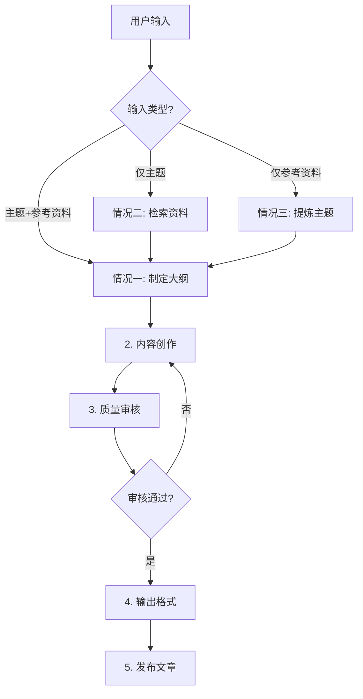

# WeChat Blog Write & Publish

本技能基于参考资料或指定主题自动创作微信公众号文章，并发布到公众号草稿箱，实现从素材到成品的全流程自动化。

## 工作流程



### 1. 接收输入

根据用户输入的不同情况，采取相应的处理策略：

#### 情况一：主题 + 参考资料
- 根据主题和参考资料，制定文章的章节大纲
- 搜索补充各章节相关信息，确保足够支撑章节的撰写
- 确定写作风格

#### 情况二：仅主题
- 自行检索相关参考资料
- 转入情况一流程

#### 情况三：仅参考资料
- 根据参考资料提炼并制定主题
- 转入情况一流程

### 2. 内容创作

严格遵循以下标准创作高质量文章：

#### 2.1 创作流程

1. **大纲设计**：根据主题和资料，设计文章结构框架
2. **信息收集**：根据主题和章节大纲内容，搜索补充相关信息
3. **信息整理**：筛选、归类、提炼参考资料中的核心信息
4. **内容撰写**：按照大纲逐章节撰写，确保逻辑连贯
5. **润色优化**：优化表达、调整排版、增强可读性

#### 2.2 内容要求

- ✅ **准确性**：严格依据参考资料，确保信息准确、来源可靠
  - 所有事实性陈述必须有据可查
  - 数据、引用需标注来源
  - 避免主观臆测和过度推断
  
- ✅ **专业性**：突出专业深度和实用价值，提供丰富的干货内容
  - 深入分析而非浅尝辄止
  - 提供可操作的建议和方案
  - 结合实际案例增强说服力
  
- ✅ **可读性**：采用通俗易懂的表达，避免过度使用专业术语，必要时提供清晰解释
  - 使用类比和比喻解释复杂概念
  - 长句拆分为短句，降低阅读负担
  - 关键概念首次出现时给出定义
  
- ✅ **逻辑性**：结构清晰，层次分明，论述连贯
  - 段落之间有过渡句或过渡段
  - 论点与论据相互支撑
  - 避免逻辑跳跃和循环论证

#### 2.3 排版设计

- ✅ **布局美观**：整体排版大方得体，视觉舒适
  - 合理留白，避免内容过于密集
  - 段落之间空一行，章节之间空两行
  
- ✅ **标题层级**：合理使用 Markdown 标题（# ## ###），层次清晰
  - 一级标题（#）：文章标题，全文仅一个
  - 二级标题（##）：主要章节
  - 三级标题（###）：子章节
  - 避免层级过多（建议不超过三级）
  
- ✅ **段落分隔**：段落长短适中，分隔清晰
  - 一个段落一半150字左右
  - 一个段落表达一个核心观点
  
- ✅ **重点突出**：使用 **加粗**、> 引用 等方式强调关键信息
  - 加粗用于强调关键词或重要结论
  - 引用用于突出金句或重要提示
  - 避免过度使用导致视觉疲劳
  - 注意：加粗和引号标点不能同时使用

#### 2.4 视觉元素

- ✅ **适度装饰**：合理运用表情符号增强可读性
- ✅ **风格平衡**：保持专业性与趣味性的平衡，避免过度娱乐化

#### 2.5 图表要求

- ✅ **流程图/架构图**：涉及流程、架构等内容时，使用 mermaid 创建可视化图表
  - 流程图：用于展示步骤、决策流程
  - 时序图：用于展示交互过程
  - 架构图：用于展示系统结构

#### 2.6 元信息格式

文章开头必须包含 Front Matter 元信息：

```markdown
---
title: 文章标题（不超过65个字，不用特殊字符）
cover: {skill_dir}/asset/微信公众号头像.png
---
```

**字段说明**：
- `title`：文章标题，需简洁有力，不超过65个字符，避免使用特殊符号
- `cover`：封面图片路径
  - 未指定时使用默认封面：`{skill_dir}/asset/微信公众号头像.png`
  - 可指定自定义封面：提供完整路径或相对路径

### 3. 质量审核（关键环节）

在文章输出前，必须执行全面的质量审核流程，确保内容准确可靠。

#### 3.1 幻觉内容检测

**检测目标**：识别并修正文档中可能存在的虚构信息。

| 检测类型 | 检测要点 | 处理方式 |
|---------|---------|---------|
| **虚构信息** | 参考资料未提及的内容、编造的事实、杜撰的引用 | 必须删除或替换为可验证的准确信息 |
| **过度推断** | 超出参考资料范围的过度解读、主观臆测、无依据的结论 | 标注为推测性表述或删除 |
| **虚假引用** | 不存在的引用来源、编造的数据出处、伪造的专家观点 | 核实来源真实性，无法验证则删除 |
| **拼凑信息** | 将不同来源信息错误组合、断章取义、语境错位 | 还原原始语境，确保信息完整准确 |

**检测方法**：
1. 逐句对照参考资料，标记所有未直接引用的内容
2. 对标记内容进行来源追溯，确认是否有可靠依据
3. 对无法验证的内容，标注为待核实或删除

#### 3.2 事实准确性核验

**核验目标**：验证核心信息的真实性与准确性。

| 核查类型 | 核查要点 | 核查方式 | 核查标准 |
|---------|---------|---------|---------|
| **时间节点** | 发布日期、事件时间、版本更新时间等 | 与官方来源或权威媒体交叉验证 | 精确到年月日，重大事件精确到时分 |
| **数据指标** | 性能数据、市场份额、用户数量等 | 核实数据来源、统计口径、时效性 | 标注数据来源和统计时间 |
| **关键人物** | 姓名、职位、贡献描述等 | 与官方介绍或权威报道对照 | 姓名、职位、机构名称准确无误 |
| **事件描述** | 事件经过、因果关系、影响范围等 | 多源交叉验证，确保客观准确 | 至少2个独立来源佐证 |
| **技术细节** | API接口、功能特性、技术参数等 | 对照官方文档或技术规范 | 与官方文档描述一致 |

**核验流程**：
1. 提取文章中所有事实性陈述
2. 按重要性分类（核心事实/辅助事实/背景事实）
3. 对核心事实进行多源交叉验证
4. 记录验证结果和来源

#### 3.3 逻辑一致性检查

**检查目标**：确保文档内容前后连贯、无矛盾。

| 检查类型 | 检查要点 | 检查方法 |
|---------|---------|---------|
| **前后连贯** | 文章开头、正文、结尾观点一致 | 检查首尾呼应，确保核心论点不变 |
| **因果合理** | 论证逻辑清晰，因果关系成立 | 验证推理链条，避免逻辑跳跃 |
| **概念统一** | 同一概念在全文中使用一致的表述 | 建立术语表，检查全文用词一致性 |
| **层次分明** | 标题与内容对应，段落之间过渡自然 | 检查标题层级，确保结构清晰 |

**检查流程**：
1. 绘制文章逻辑框架图，标注核心论点和支撑论据
2. 检查论点与论据的对应关系，确保逻辑闭环
3. 标记所有矛盾或不一致之处，逐一修正

#### 3.4 审核输出格式

审核完成后，需输出审核报告：

```markdown
## 质量审核报告

### 审核结果：✅ 通过 / ⚠️ 需修改 / ❌ 不通过

### 幻觉内容检测
- [ ] 无虚构信息
- [ ] 无过度推断
- [ ] 引用真实可靠
- **问题列表**：（如有问题，列出具体位置和内容）

### 事实准确性核验
- [ ] 时间节点已核实
- [ ] 数据指标已核实
- [ ] 关键人物已核实
- [ ] 事件描述已核实
- [ ] 技术细节已核实
- **问题列表**：（如有问题，列出具体位置和内容）

### 逻辑一致性检查
- [ ] 前后观点一致
- [ ] 因果关系合理
- [ ] 概念表述统一
- [ ] 层次结构清晰
- **问题列表**：（如有问题，列出具体位置和内容）

### 修改记录
| 原内容 | 修改后内容 | 修改原因 |
|-------|-----------|---------|
| ... | ... | ... |
```

#### 3.5 审核通过标准

只有满足以下所有条件，方可进入发布环节：

1. ✅ 无幻觉内容，所有信息均有可靠来源
2. ✅ 核心事实经核验准确无误
3. ✅ 逻辑一致，无矛盾冲突
4. ✅ 所有问题已明确标注并修改完成

**重要提示**：审核不通过的文章必须返回修改，直至满足所有标准。

### 4. 输出格式

- 将完成的文章保存为 Markdown (`.md`) 格式文件
- 确保 Markdown 语法正确，可直接用于发布
- 文件命名规范：使用文章标题+日期作为文件名
- 文件保存路径：`{skill_dir}/articles/文章名字.md`

> **免责声明**：本文由人类口述意图、AI 生成文本、人类审阅纠偏完成。文中观点代表作者个人经验，AI 生成内容已经过人工审阅，但仍可能存在表述不当之处。欢迎讨论，求轻喷 🙏

### 5. 发布文章

1. 将 Markdown 文档中 Mermaid 图表转换为图片，并在输出文档中自动替换为图片引用：

```bash
mmdc -i 文章名字.md -o 文章名字-mermaid.md -e png
```

2. 使用 wenyan 工具将 Markdown 文章发布到微信公众号草稿箱：

```bash
wenyan publish -f {skill_dir}/articles/文章名字-mermaid.md
```

#### wenyan 工具说明

**安装方式：**

```bash
# 验证是否已经安装，避免重复安装
wenyan --version

# 使用 npm 全局安装
npm install -g @wenyan-md/cli
```

**前置配置：**

1. **获取公众号 AppID 和 AppSecret**
   - 登录微信公众号后台
   - 进入"设置与开发" → "开发接口管理"
   - 复制 AppID 和 AppSecret
2. **配置IP白名单** ⚠️
   - 在公众号后台"开发接口管理" → "基本配置" → "IP 白名单"
   - 添加本机公网 IP（可通过访问 [ip.sb](https://ip.sb) 查看）
   - **重要**：未配置白名单会导致 `40164` 错误
3. **配置凭证**
   ```bash
   export WECHAT_APP_ID="你的AppID"
   export WECHAT_APP_SECRET="你的AppSecret"
   ```

**常见问题：**

1. **`40164`** **错误**：IP 不在白名单，需在公众号后台添加本机公网 IP
2. **封面图比例错误**：微信封面图要求 2.35:1，工具会自动裁剪
3. **图片上传失败**：确保图片为本地路径，或已上传至微信图床

## 使用示例

### 示例 1：基于网页链接创作

```
请根据这个链接写一篇关于 LangChain 的公众号文章：
https://python.langchain.com/docs/get_started/introduction
```

### 示例 2：基于多个参考资料

```
请根据以下资料写一篇 AI 产品经理的文章：
- 文档：/path/to/product-methods.pdf
- 链接：https://example.com/ai-pm-guide
```

## 注意事项

### 内容创作阶段

1. **内容准确性**：必须严格基于参考资料，不臆造信息，确保内容可靠
2. **格式规范**：确保 Markdown 语法正确，标题层级清晰，无语法错误

### 质量审核阶段

3. **审核强制性**：质量审核是必经环节，不可跳过，审核不通过不得发布
4. **多源验证**：关键事实信息必须通过多个权威来源交叉验证
5. **问题追溯**：所有发现的问题必须明确标注位置、内容，并记录修改过程
6. **审核留痕**：每次审核需生成完整的审核报告，作为发布前置条件