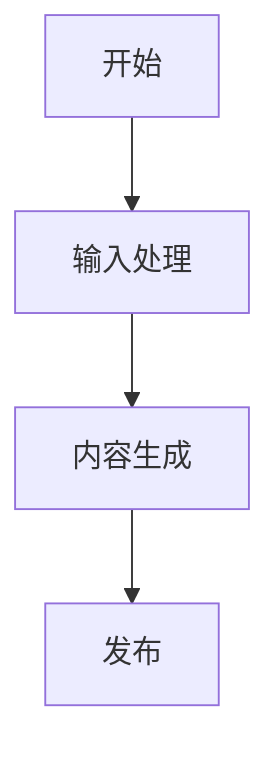

# WeChat Blog Write & Publish

本技能基于参考资料自动创作微信公众号文章，并发布到公众号草稿箱，实现从素材到成品的全流程自动化。

## 工作流程

### 1. 接收输入

- 接收用户提供的参考资料（网页链接、文档、文本内容 等）
- 确认文章主题、核心内容方向和写作风格

### 2. 内容创作

严格遵循以下标准创作高质量文章：

#### 内容要求

- ✅ **准确性**：严格依据参考资料，确保信息准确、来源可靠
- ✅ **专业性**：突出专业深度和实用价值，提供丰富的干货内容
- ✅ **可读性**：采用通俗易懂的表达，避免过度使用专业术语，必要时提供清晰解释
- ✅ **逻辑性**：结构清晰，层次分明，论述连贯

#### 排版设计

- ✅ **布局美观**：整体排版大方得体，视觉舒适
- ✅ **标题层级**：合理使用 Markdown 标题（# ## ###），层次清晰
- ✅ **段落分隔**：段落长短适中，分隔清晰
- ✅ **重点突出**：使用 **加粗**、> 引用 等方式强调关键信息

#### 视觉元素

- ✅ **适度装饰**：合理运用表情符号（如：😊、🎉、✨、📌）增强可读性
- ✅ **风格平衡**：保持专业性与趣味性的平衡，避免过度娱乐化

#### 图表要求

- ✅ **流程图/架构图**：涉及流程、架构等内容时，使用 mermaid 语法创建可视化图表
- ✅ **示例**：



#### 元信息格式

文章开头必须包含 Front Matter 元信息：

```markdown
---
title: 文章标题（不超过65个字，不用特殊字符）
cover: asset/微信公众号头像.png
---
```

### 3. 输出格式

- 将完成的文章保存为 Markdown (`.md`) 格式文件
- 确保 Markdown 语法正确，可直接用于发布

### 4. 发布文章

使用 wenyan-cli 工具将 Markdown 文章发布到微信公众号草稿箱：

```bash
wenyan publish -f 文章名字.md
```

#### wenyan-cli 工具说明

**安装方式：**

```bash
npm install -g @wenyan-md/cli
```

**前置配置：**

1. **获取公众号 AppID 和 AppSecret**
   - 登录微信公众号后台
   - 进入"设置与开发" → "开发接口管理"
   - 复制 AppID 和 AppSecret
2. **配置IP白名单** ⚠️
   - 在公众号后台"开发接口管理" → "基本配置" → "IP 白名单"
   - 添加本机公网 IP（可通过访问 [ip.sb](https://ip.sb) 查看）
   - **重要**：未配置白名单会导致 `40164` 错误
3. **配置凭证**
   ```bash
   export WECHAT_APP_ID="你的AppID"
   export WECHAT_APP_SECRET="你的AppSecret"
   ```

**常见问题：**

1. **`40164`** **错误**：IP 不在白名单，需在公众号后台添加本机公网 IP
2. **封面图比例错误**：微信封面图要求 2.35:1，工具会自动裁剪
3. **图片上传失败**：确保图片为本地路径，或已上传至微信图床

## 使用示例

### 示例 1：基于网页链接创作

```
请根据这个链接写一篇关于 LangChain 的公众号文章：
https://python.langchain.com/docs/get_started/introduction
```

### 示例 2：基于多个参考资料

```
请根据以下资料写一篇 AI 产品经理的文章：
- 文档：/path/to/product-methods.pdf
- 链接：https://example.com/ai-pm-guide
```

## 注意事项

1. **内容准确性**：必须严格基于参考资料，不臆造信息，确保内容可靠
2. **格式规范**：确保 Markdown 语法正确，标题层级清晰，无语法错误
3. **发布前检查**：执行 `publish` 命令前确认 wenyan-cli 已正确配置，文件路径正确
4. **封面图片**：默认使用 `asset/微信公众号头像.png`，请确保该路径存在或使用自定义封面
5. **IP白名单**：发布前务必在公众号后台配置本机IP白名单，避免 `40164` 错误

